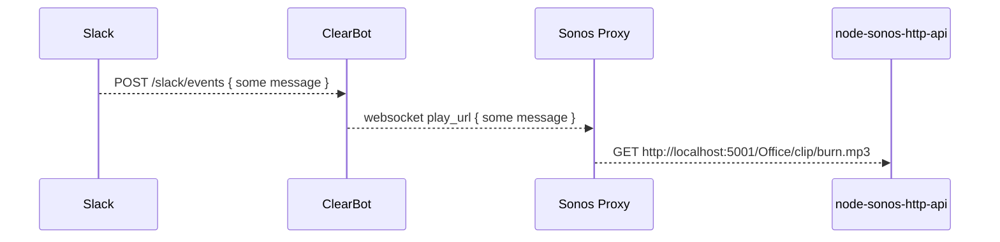

# ClearBot

This code is a Slack application (bot) written using [Slack
Bolt](https://api.slack.com/bolt). It allows users to play mp3 clips on a Sonos
speaker. It communicates with [Sonos Proxy](https://github.com/clearfunction/sonos_proxy_nodejs)
which then communicates with [node-sonos-http-api](https://github.com/jishi/node-sonos-http-api).

We affectionately refer to this as "Burn Bot."

## Architecture

## Requirements

- Yarn
- Node

## Running Locally

The easiest way to test is to set this up in a standalone Slack instance and
then use a local proxy like [ngrok](https://ngrok.com/).

- Create a Slack application (see Slack Bolt API link below)
- Run `yarn dev` (it defaults to port 3000)
- Run ngrok to create a proxy to your Bolt app (`ngrok serve 3000`)
- Point your Slack's event subscription to your ngrok URL
- Set up [Sonos Proxy](https://github.com/clearfunction/sonos_proxy_nodejs)
- Enjoy!

## Deployment

See the `Makefile`... make sure you are in the expected subscription by running `az account set --subscription YOUR_SUBSCRIPTION_ID`.

## Resources

- [Slack Bolt API](https://slack.dev/bolt/)
- [Block Kit Builder](https://api.slack.com/tools/block-kit-builder)
- [Sonos Proxy](https://github.com/clearfunction/sonos_proxy_nodejs)
- [node-sonos-http-api](https://github.com/jishi/node-sonos-http-api)
