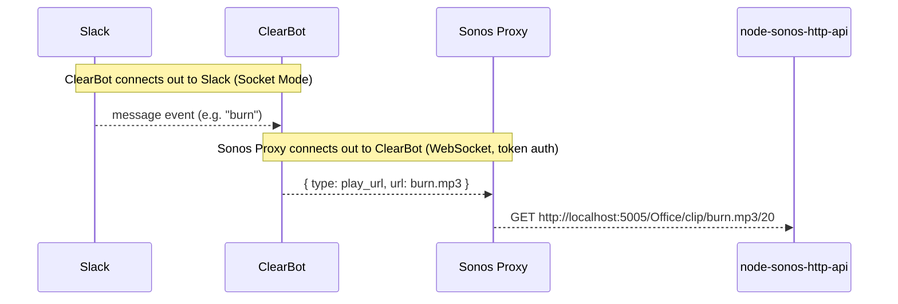

# ClearBot

This code is a Slack application (bot) written using [Slack
Bolt](https://api.slack.com/bolt). It allows users to play mp3 clips on a Sonos
speaker. It connects to Slack using **Socket Mode** (an outbound WebSocket — no
public endpoint required) and relays commands over a native WebSocket to [Sonos
Proxy](https://github.com/clearfunction/sonos_proxy_nodejs), which in turn
communicates with [node-sonos-http-api](https://github.com/jishi/node-sonos-http-api).

We affectionately refer to this as "Burn Bot."

## Architecture

Both connections are established _outbound_ — ClearBot dials Slack, and each
Sonos Proxy dials ClearBot — so neither ClearBot nor the proxies need a public
inbound endpoint. Messages then flow back over those sockets:

```mermaid
sequenceDiagram
    Note over Slack,ClearBot: ClearBot connects out to Slack (Socket Mode)
    Slack-->>ClearBot: message event (e.g. "burn")
    Note over ClearBot,Sonos Proxy: Sonos Proxy connects out to ClearBot (WebSocket, token auth)
    ClearBot-->>Sonos Proxy: { type: play_url, url: burn.mp3 }
    Sonos Proxy-->>node-sonos-http-api: GET http://localhost:5005/Office/clip/burn.mp3/20
```

## Requirements

- Bun

## Running Locally

Because ClearBot uses Socket Mode, it connects _out_ to Slack — there is no
public endpoint to expose.

- Create a Slack app and **enable Socket Mode** (Settings → Socket Mode).
- Generate an **app-level token** (Basic Information → App-Level Tokens) with the
  `connections:write` scope — this is the `xapp-…` token.
- Under **Event Subscriptions**, subscribe to the bot message events (e.g.
  `message.channels`). With Socket Mode on there is no Request URL to set.
- Copy `.env.example` to `.env` and fill in:
  - `SLACK_BOT_TOKEN` — the bot token (`xoxb-…`)
  - `SLACK_APP_TOKEN` — the app-level token (`xapp-…`)
  - `RELAY_TOKEN` — a shared secret the Sonos Proxy must also use (generate with
    `openssl rand -hex 32`)
- Run `bun install`, then `bun run dev` (defaults to port 3000).
- Set up [Sonos Proxy](https://github.com/clearfunction/sonos_proxy_nodejs)
  pointed at `ws://localhost:3000` with the same `RELAY_TOKEN`.
- Enjoy!

## Deployment

See the `Makefile`... make sure you are in the expected subscription by running `az account set --subscription YOUR_SUBSCRIPTION_ID`.

The relay uses WebSockets, which are **disabled by default** on Azure App
Service — run `make websockets` to enable them, and `make appsettings` to set
`SLACK_BOT_TOKEN`, `SLACK_APP_TOKEN`, and `RELAY_TOKEN` on the web app.
(`SLACK_SIGNING_SECRET` is no longer used now that the bot runs in Socket Mode.)

## Resources

- [Slack Bolt API](https://slack.dev/bolt/)
- [Block Kit Builder](https://api.slack.com/tools/block-kit-builder)
- [Sonos Proxy](https://github.com/clearfunction/sonos_proxy_nodejs)
- [node-sonos-http-api](https://github.com/jishi/node-sonos-http-api)
